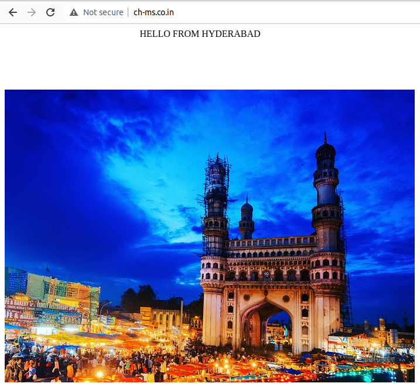
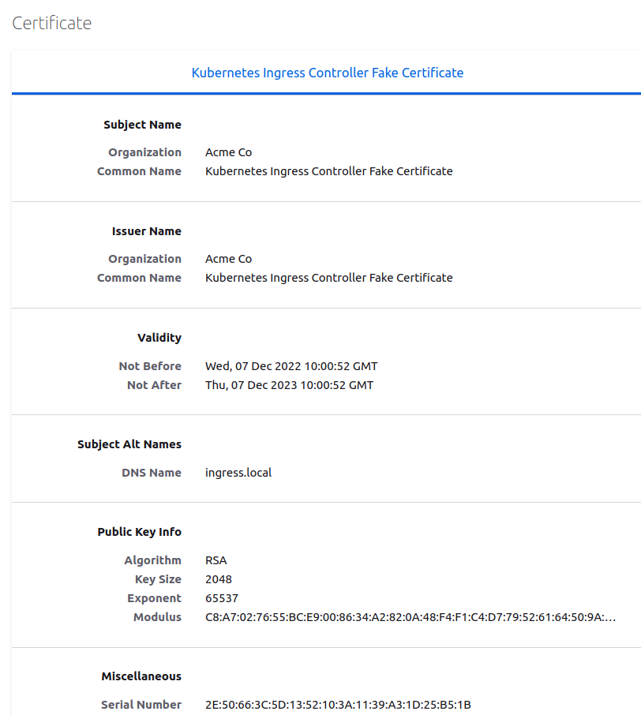

Hirerachy - Pods >> Replicaset >> Deployment >> Services >> Ingress & Ingress Controller

Using loadbalancer for every service is very costly and it has limitations as well. To overcome this, we need to use ingress controller

**Ingress is nothing but, traffic flow from outside (internet) to pods. Controlling will happen through Ingress Controller (where the traffic should flow, based on the hostname/url endpoints etc)**

## Ingress Contollers
* Nginx
* Traefik
* Kong
* Contour
* AWS ALB

## Commands
`alias k=kubectl`  

-- Deployments
* `k create deploy delhi-deploy --image=chmadhus/web-server-1:delhi --replicas 3 --dry-run=client -o yaml`
* `k create deploy hyderabad-deploy --image=chmadhus/web-server-2:hyderabad --replicas 3 --dry-run=client -o yaml`
* `k create deploy bangalore-deploy --image=chmadhus/web-server-3:bangalore --replicas 3 --dry-run=client -o yaml`
* `k create deploy tamilnadu-deploy --image=chmadhus/web-server-4:tamilnadu --replicas 3 --dry-run=client -o yaml`

----------
-- Services
* `k expose deploy delhi-deploy --port=8000 --target-port=80 --dry-run=client -o yaml`
* `k expose deploy hyderabad-deploy --port=8000 --target-port=80 --dry-run=client -o yaml`
* `k expose deploy bangalore-deploy --port=8000 --target-port=80 --dry-run=client -o yaml`
* `k expose deploy tamilnadu-deploy --port=8000 --target-port=80 --dry-run=client -o yaml`

------------

Now, we need to deploy ingress controller, I'm going to use [Nginx](https://raw.githubusercontent.com/kubernetes/ingress-nginx/controller-v1.0.5/deploy/static/provider/aws/deploy.yaml)

* `k apply -f https://raw.githubusercontent.com/kubernetes/ingress-nginx/controller-v1.0.5/deploy/static/provider/aws/deploy.yaml`
* `k get pods -n ingress-nginx` - ingress controller is running
* `k get svc -n ingress-nginx` - ingress controller external ip will be in `<pending state>`, because we don't have any load balancer as we've deployed our k8s in baremetal systems. Don't worry we have solution called [Metallb](https://metallb.universe.tf/) [check 5.1 metallb > notes.md - and configure metallb]
* Now check the `k get svc -n ingress-nginx` - we'll get an external ip (in mycase it is 172.16.16.240 ), check that ip in browser, you'll not get anything because we just create an ingress controller but we haven't given any rules (ingress resource) on how the routing should happen

## [GoDaddy](https://www.godaddy.com/en-in)
* Now to create an ingress, you need a domain name, this will be only amount/price you need to pay. I have created my domain as `ch-ms.co.in` and in godaddy i've added the A record under DNS Management 
  
* `k apply -f ingress-resource-without-tls.yaml` - in this we have defined like, if any user from the internet hits on `www.ch-ms.co.in` , request goes through >> godaddy >> metallb >> hyderabad-svc listening on port 8000 >> pods
* `k describe ing hyderabad-deploy-ingress` - under rules you'll see what's the host, path and backends  

--------
### Output

**Here there is a problem, as you can see, endpoint in Not secure**

Now we need SSL/TLS Certifcate to make it secure - I'm going to use [LetsEncrypt](https://letsencrypt.org/) to get me the fake certificates, check `5. LetsEncrypt`  

Yayy, we got a free fake ceritificate  

 

 

 

Now in the same way deploy other ingress-resoueces
* `k apply -f ingress-resource-3.yaml`
* `k apply -f ingress-resource-4.yaml`
* `k apply -f ingress-resource-5.yaml`