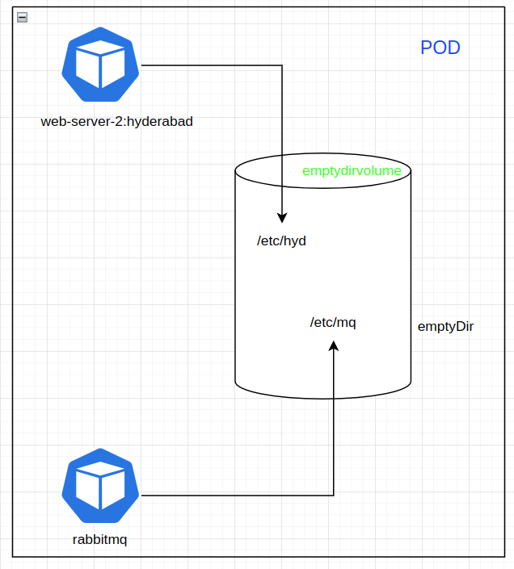

Hirerachy - StorageClass >> Persistent Volume >> Persistent Volume Claim >> POD

**Storage**

Different types of storages,
1. emptyDir
2. hostpath
3. Persistent volume and persistent volume claims using EBS
4. AWS EBS volume 
5. Using AWS EFS for storage

**1. emptyDir**

As we already know, in a pod we can have application container, if required a sidecar container and there can be n number of containers, there will be default volume which is called as emptyDir. We don't need to create this emptyDir, it'll be there by default for every pod. if pod gets deleted then emptyDir will also be deleted

`k apply -f emptyDir.yaml`

So below we've defined volume named `emptydirvolume` (name should be in lowercase only), so this is the centralised volume and on this volme we can mount with different directories </br> 
I have created two mount points, `/etc/mq` and `/etc/hyd`



Now, enter into each pod and type `df -hT`
To get into a pod, `k exec -it <pod-name> -- bash`

```
❯ k get pods -l app=web-server
NAME                                     READY   STATUS    RESTARTS   AGE
web-server-deployment-84bb78cd8c-2d2pp   2/2     Running   0          93s
web-server-deployment-84bb78cd8c-9ljv2   2/2     Running   0          40s
web-server-deployment-84bb78cd8c-mg8fm   2/2     Running   0          66s

❯ k exec -it web-server-deployment-84bb78cd8c-2d2pp -c rabbitmq -- bash
root@web-server-deployment-84bb78cd8c-2d2pp:/# df -hT

Filesystem                        Type     Size  Used Avail Use% Mounted on
/dev/mapper/ubuntu--vg-ubuntu--lv ext4      62G  9.3G   50G  16% /etc/mq

❯ k exec -it web-server-deployment-84bb78cd8c-2d2pp -c web-server-2 -- bash
root@web-server-deployment-84bb78cd8c-2d2pp:/usr/local/apache2# df -hT

Filesystem                        Type     Size  Used Avail Use% Mounted on
/dev/mapper/ubuntu--vg-ubuntu--lv ext4      62G  9.3G   50G  16% /etc/hyd
```


**2. hostpath**

If the container in running on a host/node, then we can create a path in the node/host and mount that path to the container

A `hostPath` volume mounts a file or directory from the host node's filesystem into your Pod. This is not something that most Pods will need, but it offers a powerful escape hatch for some applications.


```
❯ k get pods -o wide -l app=web-server-1
NAME                                      READY   STATUS    RESTARTS   AGE   IP               NODE       NOMINATED NODE   READINESS GATES
web-server-1-deployment-c759b94d4-cr68x   1/1     Running   0          11m   192.168.41.148   kworker1   <none>           <none>
web-server-1-deployment-c759b94d4-w8rmw   1/1     Running   0          11m   192.168.41.149   kworker1   <none>           <none>

As you can see i'm inside `web-server-1-deployment-c759b94d4-cr68x` and it created a folder/directory named `web-server-1` in /usr/

_ k exec -it web-server-1-deployment-c759b94d4-cr68x -- bash
root@web-server-1-deployment-c759b94d4-cr68x:/usr/local/apache2# cd /usr/            
root@web-server-1-deployment-c759b94d4-cr68x:/usr# ls -ltr | grep web-server-1
drwxr-xr-x 2 root root 4096 Dec 12 15:46 web-server-1
root@web-server-1-deployment-c759b94d4-cr68x:/usr/web-server-1# 

─────────────────────────────────────────────────────────────────────────────────────────────────────────┬──────────────────────────────────────────────────────────────────────
_ ssh root@172.16.16.101   (kworker1)                                                                    │_ ssh root@172.16.16.102 (kworker2)
root@172.16.16.101's password:                                                                           │root@172.16.16.102's password: 
Last login: Mon Dec 12 15:50:12 2022 from 172.16.16.1                                                    │Last login: Mon Dec 12 15:46:17 2022 from 172.16.16.1
root@kworker1:~# cd /tmp/testinghostpath                                                                 │root@kworker2:~# cd /tmp/testinghostpath
root@kworker1:/tmp/testinghostpath#                                                                      │root@kworker2:/tmp/testinghostpath# 


Now we'll create a file in the container, `touch file` - my expectation is it should create `file` in kworker1 


root@web-server-1-deployment-c759b94d4-cr68x:/usr/web-server-1# touch file
root@web-server-1-deployment-c759b94d4-cr68x:/usr/web-server-1# 

                                                                                                         │root@kworker2:/tmp/testinghostpath# ls -ltr
root@kworker1:/tmp/testinghostpath# ls -ltr                                                              │total 0
total 0                                                                                                  │root@kworker2:/tmp/testinghostpath# 
-rw-r--r-- 1 root root 0 Dec 12 15:56 file                                                               │
root@kworker1:/tmp/testinghostpath#                                                                      │
```
Yayyy :heart_eyes: :heart_eyes: :heart_eyes:

But but but ....

**Warning**: </br>
HostPath volumes present many security risks, and it is a best practice to avoid the use of HostPaths when possible. When a HostPath volume must be used, it should be scoped to only the required file or directory, and mounted as ReadOnly.

If restricting HostPath access to specific directories through AdmissionPolicy, volumeMounts MUST be required to use readOnly mounts for the policy to be effective.


**3. PV (Persistent Volume) and PVC (Persistent Volume Claim)**

Why do you want to use PV ?? </br>
So when you deploy a pod in your kubernetes clutser, any data stored in your applications is gonna be valid only till the pod exist.
So lifetime of the data is lifetime of the pod. What if you want the persistent data. That's when we need to think of PV's. If we use PV, the application you're using can store data in PV and even if the pod dies, then scheduler restarts the pod, it can again start using the data that it has previously work upon.

**How you can use PVs?**

    In kubernetes cluster, 
    1. First you've create PV
    2. Usually Cluster Admins will be creating PVs, and users of the cluster will be requesting the PV and that's called PVC. So you're gonna claim a PV
    3. Create a pod that uses the PVC to get to the PV

    This is not an automated task..So whenever you want to use PV, you have to request cluster admin beforehand to create PV for you. This is static provisioning. You're gonna tell cluster admin that i'm going to deploy a mysql application or a web application. I need a PV to store my data and then you tell him/her the size of your requirement like i want 10GB of storage for my application. Then cluster admin will creates a PV of 10GB. 

    There's also something called as dynamic provisioning, that's automated, in that case cluster admin is going to create something called as `storage class`. so when you request PV using PVC, you define a storage class and then based on storage class, volume gets provisioned automatically and when you're done with your application, you can delete the volume that got created automatically. But dynamic provisioning is supported only by few providers, ex - you can use AWS EBS, GCP Compute Disk, Microsoft Azure Disk, Azure file.

    It's the responsibility of cluster admin to create the storage class and once it's there you have to refer that in PVC, then you should be able to request a PV which gets provision automatically on AWS/GCP/Azure

    Other thing you need to know about PV is, PV say for static provisioning, if a cluster admin has created a PV of 10GB and in your PVC you specify 1GB or 2GB request, then it's gonna match the availble PV in the cluster and it's gonna match depending on what you've requested. Ex- you've request 2GB and there's a PV provisioned in the cluster for 10GB and nobody else has requested that PV, your PVC will be granted to that PV so which means, no ther PVC can claim the PV. That's one-to-one mapping. So if a PVC is attached to a PV. No other PVC can request that PV unless you delete the pod and release the request. Once the request is released and you're done with that then the cluster administrator will delete the resource and recreate it. So it's one-to-one mapping.

**Lifecycle of PV**

    What happens when we delete a pod/deployment that was using PV, there are 3 options that you can pass for reclaim policy 
    1.  Retain (default) - which means once the pod is deleted, the PV will still be there, data will still be there and no other PVC will be given this PV, unless the cluster admin deleted the content in that PV
    2.  Recycle - this is more for dynamic provisioning and it's deprecated
    3.  Delete - Which means when you delete the pod and PVC, it's gonna delete PV and the associated data as well..

    Access mode:
    1. RWO (Read Write Once) 
    2. RWM (Read Write Many)
    3. RO (Read Only)

    RWO - So there is a PV, you've got a PVC and you're deploying a deployment with 3 replicas and RWO means, this will get mounted as Read-Write on one node, so if your pod gets scheduled on multiple nodes only the first node will be able to read-write to that PV. All the other nodes will only be able to read
    RWM - So it can be mounted on different nodes and all your pods in deployment set will be able to read and write to that PV
    RO - just read only, mounts the volume inside your pod from any # of nodes and you won't be able to write anyhing

I'm going to create a PV in hostPath (directory in one of your node), although this is not recommended, in real time we use AWS/GCP/Azure Volumes or Dynamic Provisioning.

First we'll create a PV,

```
cd pv
k apply -f pv-hostpath.yaml - this gonna create a hostpathdir in one of your node and when you run a pod on that node it mounts that host volume in that node, so even if the pod dies, data will still be there in your node directory 

❯ k get pv -o wide
NAME          CAPACITY   ACCESS MODES   RECLAIM POLICY   STATUS      CLAIM   STORAGECLASS   REASON   AGE   VOLUMEMODE
pv-hostpath   1Gi        RWO            Retain           Available           manual                  13s   Filesystem

Now let's create PVC
cd ../pvc
`k apply -f pvc-hostpath.yaml` - request that you're created to use the PV, storage class, access modes should match with PV that we've created

❯ k get pvc -o wide
NAME           STATUS   VOLUME        CAPACITY   ACCESS MODES   STORAGECLASS   AGE   VOLUMEMODE
pvc-hostpath   Bound    pv-hostpath   1Gi        RWO            manual         6s    Filesystem

Now, check the pv

❯ k get pv -o wide
NAME          CAPACITY   ACCESS MODES   RECLAIM POLICY   STATUS   CLAIM                  STORAGECLASS   REASON   AGE     VOLUMEMODE
pv-hostpath   1Gi        RWO            Retain           Bound    default/pvc-hostpath   manual                  6m12s   Filesystem

Now we need to create a POD or deployment that uses this PV
cd ../pod-using-pv-pvc
`k apply -f pod.yaml`

❯ k get pods -o wide
NAME         READY   STATUS    RESTARTS   AGE   IP               NODE       NOMINATED NODE   READINESS GATES
web-server   1/1     Running   0          53s   192.168.77.129   kworker2   <none>           <none>

❯ k describe pod web-server
Containers:
  web-server-2:
    Container ID:   containerd://57ede9bf1361249cac74f6a4ae09a43c5d28814c763200172f66c082b5a30ea8
    Image:          chmadhus/web-server-2:hyderabad
    Image ID:       docker.io/chmadhus/web-server-2@sha256:b15e1c783ffd5cda7c535fd09b9d04b8b19927e9905f6b18fe0c65f71c40b8da
    Port:           <none>
    Host Port:      <none>
    State:          Running
      Started:      Tue, 13 Dec 2022 13:31:18 +0530
    Ready:          True
    Restart Count:  0
    Environment:    <none>
    Mounts:
      /mydata from host-volume (rw)
Volumes:
  host-volume:
    Type:       PersistentVolumeClaim (a reference to a PersistentVolumeClaim in the same namespace)
    ClaimName:  pvc-hostpath
    ReadOnly:   false

❯ k get pods
NAME         READY   STATUS    RESTARTS   AGE
web-server   1/1     Running   0          6m13s

❯ k exec -it web-server -- bash
root@web-server:/usr/local/apache2# cd /mydata/
root@web-server:/mydata# ls -ltr
total 0
root@web-server:/mydata# 


❯ ssh root@kworker2
root@kworker2's password: 
root@kworker2:~# cd /
root@kworker2:/# ls -ltr | grep host
drwxr-xr-x   2 root root       4096 Dec 13 08:01 hostpathdir

Now let's write some data inside /mydata

root@web-server:/mydata# touch helloworld
root@web-server:/mydata# ls
helloworld

Now check the kworker2

root@kworker2:~# ls -ltr /hostpathdir/
total 0
-rw-r--r-- 1 root root 0 Dec 13 08:08 helloworld
root@kworker2:~# 

Now i'm going to delete the pod,

> k delete pod web-server
pod "web-server" deleted

Check the pv,pvc - still bound
❯ k get pv,pvc
NAME                           CAPACITY   ACCESS MODES   RECLAIM POLICY   STATUS   CLAIM                  STORAGECLASS   REASON   AGE
persistentvolume/pv-hostpath   1Gi        RWO            Retain           Bound    default/pvc-hostpath   manual                  21m

NAME                                 STATUS   VOLUME        CAPACITY   ACCESS MODES   STORAGECLASS   AGE
persistentvolumeclaim/pvc-hostpath   Bound    pv-hostpath   1Gi        RWO            manual         16m


Lets delete the pvc
❯ k delete pvc pvc-hostpath
persistentvolumeclaim "pvc-hostpath" deleted

❯ k get pv,pvc - coz the reclaim policy is retain, deleting the pvc will not delete the pv and also status is released, original claim is also there
NAME                           CAPACITY   ACCESS MODES   RECLAIM POLICY   STATUS     CLAIM                  STORAGECLASS   REASON   AGE
persistentvolume/pv-hostpath   1Gi        RWO            Retain           Released   default/pvc-hostpath   manual                  22m

now check the kworker2,

root@kworker2:~# ls -ltr /hostpathdir/
total 0
-rw-r--r-- 1 root root 0 Dec 13 08:08 helloworld
root@kworker2:~# 

Now what happens if we create a PVC again, but as i mentioned earlier, any other PVC will not be able to use this PV, although no request/pod is pointing to this PV

`k create -f pvc-hostpath.yaml`
❯ k get pvc
NAME           STATUS    VOLUME   CAPACITY   ACCESS MODES   STORAGECLASS   AGE
pvc-hostpath   Pending                                      manual         8s

❯ k describe pvc pvc-hostpath
Name:          pvc-hostpath
Namespace:     default
StorageClass:  manual
Status:        Pending
Volume:        
Labels:        <none>
Annotations:   <none>
Finalizers:    [kubernetes.io/pvc-protection]
Capacity:      
Access Modes:  
VolumeMode:    Filesystem
Used By:       <none>
Events:
  Type     Reason              Age               From                         Message
  ----     ------              ----              ----                         -------
  Warning  ProvisioningFailed  1s (x5 over 54s)  persistentvolume-controller  storageclass.storage.k8s.io "manual" not found

So let's delete the pv and pvc
`k delete pvc pvc-hostpath`
`k delete pv pv-hostpath`

Now check the kworker2
root@kworker2:~# ls -ltr /hostpathdir/
total 0
-rw-r--r-- 1 root root 0 Dec 13 08:08 helloworld

```


```
Now lets modify reclaim policy to delete in PV
cd pv
`k apply -f pv-hostpath-delete-policy.yaml` - in this i've added the persistent volume reclaim policy as Delete and also changed hostPath from /hostpathdir to /tmp/hostpathdir because, Why? will tell you..

❯ k get pv
NAME          CAPACITY   ACCESS MODES   RECLAIM POLICY   STATUS      CLAIM   STORAGECLASS   REASON   AGE
pv-hostpath   1Gi        RWO            Delete           Available           manual                  5s

cd ../pvc
`k apply -f pvc-hostpath.yaml`

❯ k get pvc
NAME           STATUS   VOLUME        CAPACITY   ACCESS MODES   STORAGECLASS   AGE
pvc-hostpath   Bound    pv-hostpath   1Gi        RWO            manual         3s

Now if we delete the pvc, it'll automatically delete the PV as well, because we have said the Reclaim policy as Delete and also mounted the hostpath directory to /tmp. 

❯ k delete pvc pvc-hostpath
persistentvolumeclaim "pvc-hostpath" deleted
❯ k get pv,pvc
No resources found

So if you mount hostpath on /tmp directory then when you delete the pvc, it'll automatically delete the pv as well, if we give any other directory then pv will not be delete and the status will be in Failed

```
*Cannot demonstrate 4. AWS EBS volume and 5. Using AWS EFS for storage as it involves cost, cloud provider and also it requires us to define kubernetes cluster name in tags when we are creating PV's also EBS volumes has a availability limitations, which means if the nodes are running in ap-south-1a then you can use only the EBS volume which is in ap-south-1a* </br>

You can refere these docs</br>
    - https://asvignesh.in/pod-and-persistent-volume-with-existing-ebs-in-eks/ </br>
    - https://medium.com/avmconsulting-blog/persistent-volumes-pv-and-claims-pvc-in-kubernetes-bd76923a61f6 </br>

In realtime we are gonna use any cloud provider and in that we are creating EBS volumes, then PV, then PVC - here developer is dependent on cloud admin

If we take AWS, 
    cloud admin will create PV, then developer will come and run `k get pv` and see that there will be a storage avaiable and he'll use that storage class name, how much storage is required in his/her PVC and then attach that claim to pod. This is all fine, but still there is a dependency on cloud admin. Dependency is cloud admin has to create the PV. This is a good solution if cloud admin wants to be in control, Also at the same time this is a delay process. So the other option is called `Dynamic Provisioning` where developers will submit the storage, then that will be created in the backend. So here there is no dependency on the cloud admin.

    So cloud admin will create the storage class (gp2, io1 etc) for one time, and then developers can directly create PVC and in that they need to mention size, storage class name and that's it. it'll create the EBS volume in AWS

    ex: 
    
    StorageClass:
        kind: StorageClass
        apiVersion: storage.k8s.io/v1
        metadata:
            name: aws-gp2
        provisioner: kubernetes.io/aws-ebs
        parameters:
            zone: ap-south-1a
            #zones: ap-south-1a, ap-south-1b
            type: gp2
            fsType: ext4


    PVC:
        kind: PersistentVolumeClaim
        apiVersion: v1
        metadata:
        name: auto-pv-creation
        spec:
        storageClassName: aws-gp2
        accessModes:
            - ReadWriteMany
        resources:
            requests:
                storage: 1Gi


There is also one more option which `Dynamic NFS Provisioning` - where i'll create an ubuntu machine which has nfs-server installed and create a directory and export that directory in /etc/exports and use that server ip and mount point in my pod - i will add these later               
    


